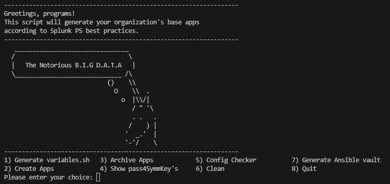

# Splunk Ansible 
This is a collection of tried-and-true Ansible playbooks and configurations for managing Splunk that have been implemented and are in-use in production environments of very large BYOL customers. They are designed to work within AWS as the environment but could be ammended to work in other Cloud PaaS providers like Google Cloud or Azure. The specific design of the playbooks is to solidify the order of operations for specific tasks within Splunk and are especially effective in large environments.

[!CAUTION]
I am **NOT** an Ansible expert and this is **NOT** based on [splunk-ansible](https://github.com/splunk/splunk-ansible) or the [ansible-role-for-splunk](https://github.com/splunk/ansible-role-for-splunk) when it probably should have been. As such, there are certiainly going to be ways to use Ansible that will blow these playbooks and configurations away but they have been very useful at customers I manage and are very accessible for people that may not have a background in how Ansible works. If you aren't an expert on Ansible but still want to leverage its orchestration abilities, these may fit your needs and I encourage anyone who uses them to tailor them to your heart's content. I am happy to provide guidance on how the flow of these playbooks work if there are questions and make recommendations for improvements but, for the most part, I am providing these as-is.

## Setup
There are quite a few steps to take before these playbooks can be leveraged and some information you will need in order to get started. This set of playbooks was originally designed with a static inventory in mind so having hostnames or IP addresses of the hosts in the environment as well as knowing what hosts are response for which role in Splunk will be paramount to intiating usage. I've also included a template file for dynamically targeting an environment deployed in AWS that I will talk through later.

### Splunk Base Apps
You will need some Splunk-specific details like URLs of Splunk assets, naming configurations for Splunk components (indexer and search head cluster labels, admin credentails, output configurations, etc.) and will need to generate the base apps used within the environment using the included script called [baseapps.sh](splunk_base_apps/baseapps.sh). The script was designed to generate the necessary base apps for any deployment with the details about the environment populated in the [customer_variables.sh](splunk_base_apps/customer_variables.sh) file. You can pre-populate the `customer_variables.sh` file with the environmental variables necessary for generating the base apps OR you can run the `baseapps.sh` script and it will walk you through populating that file.



The `customer` prefix should be changed to a naming schema of the base apps being generated. When running the script, it will ask you for a "organization configuration". This refers to the `customer_variables.sh` file in the same directory. This can allow you to generate multiple sets of base apps for different environments and keep those configurations separated. It also allows for you to designate different inventory configurations for Ansible to leverage the same playbooks against different environments simultaneously.

For example, say I am creating apps for a PROD environment at customer `buttercup`. My organization would be `buttercup_prod`. After running through the guided setup of the variables, a `buttercup_prod_variables.sh` file is generated in the directory which stores those variables for that environment only and can be used to generate the multiple base apps in a separate directory. I can then create another variables file by changing my organization to `buttercup_test` that are unique to another environment and store them side by side.

Fun fact: I originally designed this script to make it easy to dissemniate base apps in environments where SCP is difficult or forbidden since you can just paste the files next to each other and produce base apps anywhere you have CLI access.

### Ansible Environment
Once you have the base apps generated for the enviroment, the next step is to configure Ansible variables. 

1. Populate the provided [hosts](inventory/hosts) file. The headers in the hosts file are the groups the playbooks utilize to know what component to run the playbooks against. The hosts file should be filled out according to each environment. You can create a copy of the `inventory` directory to manage multiple environments at once populating the hosts files with the different hosts.
2. Edit the variables for the [splunk-servers](roles/splunk-servers/vars/main.yml) role to align with the environment you're working in.
3. Edit the variables for the [splunk-forwarders](roles/splunk-forwarders/vars/main.yml) role to align with the environment you're working in IF you will be using Ansible to manage UF's.
4. If there is a need to manage SOAR in this environment, there are playbooks included for installation and upgrading SOAR as well and it will require configurations to be made in [soar-servers](roles/soar-servers/vars/main.yml) role
5. Edit the [ansible.cfg](ansible.cfg) file to configure logging and other Ansible-related configurations based on the environment you're working in.

### AWS Dynamic Inventory
You can also tailor the configuration for the AWS dynamic inventory via the [template file](inventory/splunk.aws_ec2.template) file if the environment is hosted in AWS. Groups can be easily created using the tags defined in the example or leverage tags already used within the environment to create target groups.

### Constistent Splunk Group Names
Throughout this repo, there are consistent group names used within the inventory and playbooks that help ensure proper targeting of assets.

| Splunk Role | Ansible Group |
| ----------- | ------------- |
| Cluster Manager | clustermanager |
| Indexer | indexer
| License Manager | licensemanager |
| Deployment Server | deploymentserver | 
| Monitoring Console | monitoringconsole |
| Search Head (Stand Alone or Clustered) | search |
| Heavy Forwarder | hf |
| SHC Deployer | shcdeployer |
| SHC Clustered Search Heads Only | cluster_search |

The playbooks are also designed to work with search head clusters through strategic naming conventions. To target a search head cluster requires two groups and a consistent prefix used to identify the cluster. The first group contains all search head cluster members and the SHC deployer for the cluster. The second group is just the cluster search heads. The cluster prefix can be anything you choose. For example, below is an example of how two search head clusters should be configured.

```
# This first cluster represents the "core" search head cluster
[coresearch]
sh1.buttercupgames.com
sh2.buttercupgames.com
sh3.buttercupgames.com
corshd.buttercupgames.com

[coresearchheads]
sh1.buttercupgames.com
sh2.buttercupgames.com
sh3.buttercupgames.com

# This second cluster represents a ITSI cluster in the same environment
[itsisearch]
itsi1.buttercupgames.com
itsi2.buttercupgames.com
itsi3.buttercupgames.com
itsishd.buttercupgames.com

[itsisearchheads]
itsi1.buttercupgames.com
itsi2.buttercupgames.com
itsi3.buttercupgames.com
```

Notice the only real difference between the groups is that the first group contains the deployer. This ensures that when bundle pushes occur within the environment, each deployer will push only to search heads within the cluster.

To ensure the proper prefix is applied to the right cluster, you'll also need to create a matching group for the cluster in [group_vars](inventory/group_vars) with at least the following two variables defined:
```
group_prefix: [the prefix of the cluster group]
shc_label: [the desired SHC cluster label]
```
